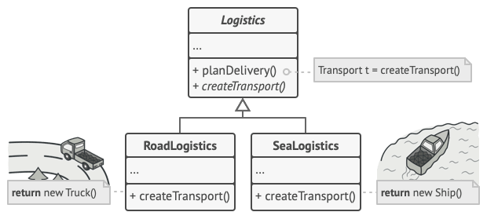
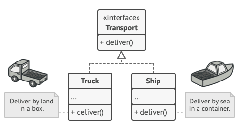
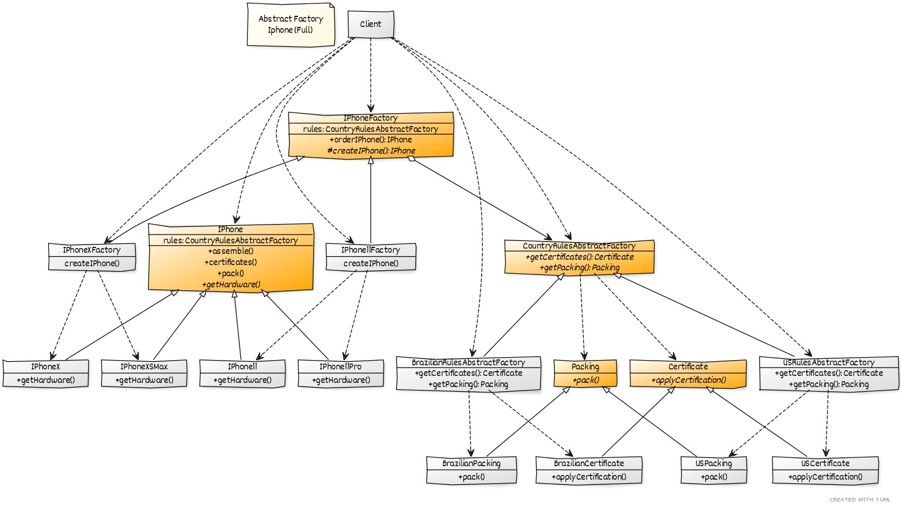
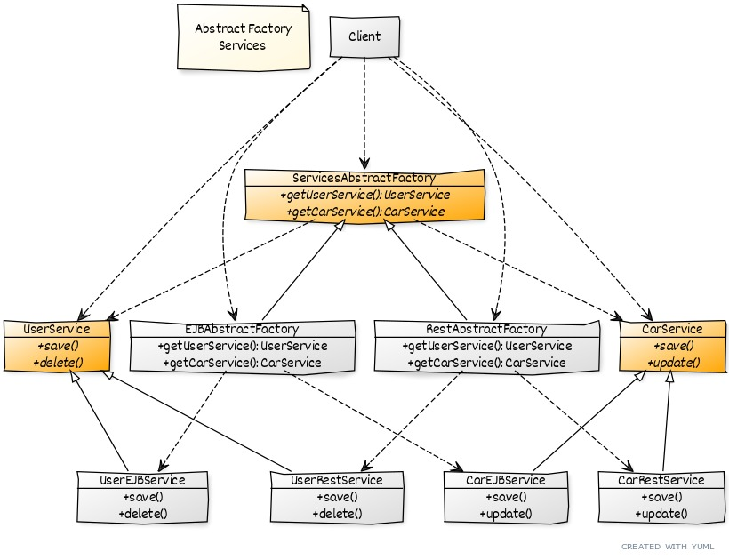
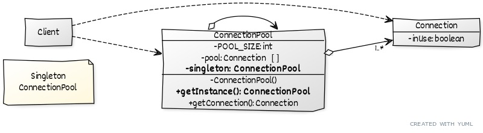
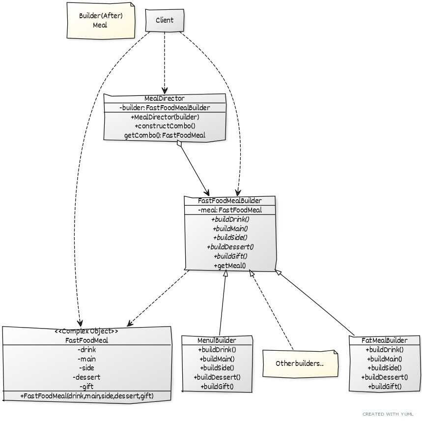
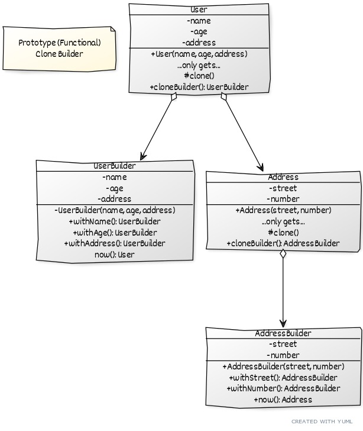

# Design Pattern Study

## Introduction

This repository goal is to study and improve the knowledge of design patterns and code SOLID.

### Material to study: 

[Refactoring Guru](https://refactoring.guru/design-patterns)

## Design patterns 

### Creational :
- **Factory** : CreationalPattern.Factory Method is a creational design pattern that provides an interface for creating objects in a superclass, but allows subclasses to alter the type of objects that will be created.

    
    

  
- **Abstract Factory** : Abstract CreationalPattern.Factory is a creational design pattern that lets you produce families of related objects without specifying their concrete classes.

- **Singleton** : CreationalPattern.Singleton is a creational design pattern that lets you ensure that a class has only one instance, while providing a global access point to this instance.

- **Builder** : CreationalPattern.Builder is a creational design pattern that lets you construct complex objects step by step. The pattern allows you to produce different types and representations of an object using the same construction code.

- **Prototype** : Prototype is a creational design pattern that lets you copy existing objects without making your code dependent on their classes.

